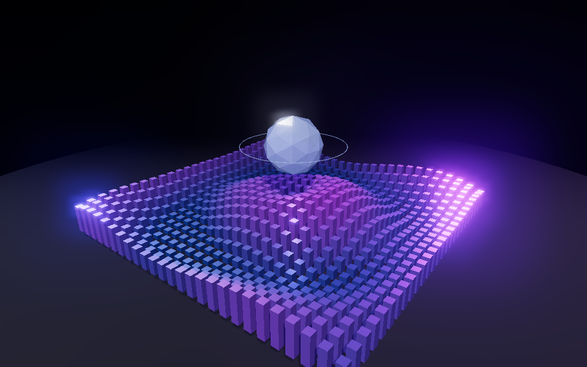
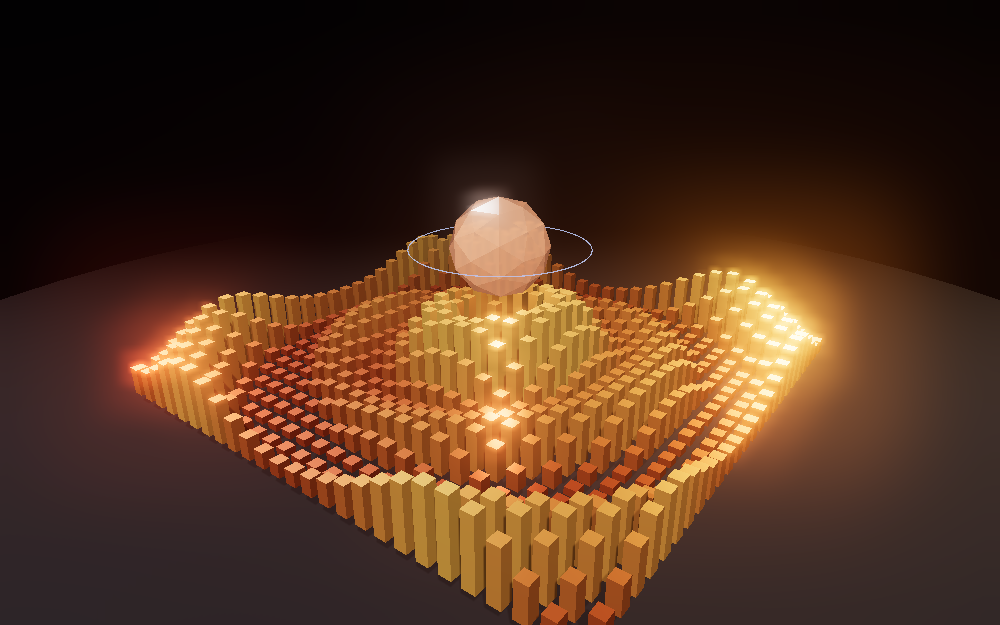

# Kinetic Lattice — Three.js demo



A single-file Three.js scene: an instanced wave field of 676 bars rippling around a refractive
floating core, with a three-point light rig, soft shadows, image-based lighting, and bloom.

Built with the `threejs-webgl` skill from this repo.

## Run it

No build step and no install — `index.html` pulls Three.js from a CDN via an import map:

```bash
# any static server works; ES modules won't load over file://
python3 -m http.server 8000
# → http://localhost:8000/demo/
```

### Running offline

If your network blocks `cdn.jsdelivr.net`, vendor Three.js locally instead:

```bash
npm install three@0.160.0
mkdir -p demo/vendor && cp node_modules/three/build/three.module.js demo/vendor/
cp -r node_modules/three/examples/jsm demo/vendor/addons
```

then point the import map at the local copies:

```json
{ "imports": {
    "three": "./vendor/three.module.js",
    "three/addons/": "./vendor/addons/"
} }
```

## Controls

| Input | Action |
|---|---|
| drag | orbit |
| scroll | zoom |
| click | shift palette (raycast) |
| <kbd>space</kbd> | pause the simulation |
| <kbd>r</kbd> | toggle auto-rotate |

## Techniques

Each of these comes from the `threejs-webgl` skill's guidance:

- **`InstancedMesh`** — all 676 bars are one geometry, one material, one draw call. Per-instance
  transforms via a single reused `Object3D`, colours via `setColorAt`.
- **No allocation in the render loop** — instance offsets and radii are precomputed into typed
  arrays; `dummy`, `tint`, and the palette colours are scratch objects created once.
- **`DynamicDrawUsage`** on `instanceMatrix`, since every instance is rewritten each frame.
- **Three-point lighting** — key (shadow-casting) + fill + rim, over ambient and hemisphere base.
- **Image-based lighting** — `RoomEnvironment` prefiltered through `PMREMGenerator`. Without an
  environment, the core's `transmission` and `clearcoat` have nothing to refract and render flat grey.
- **Soft shadows** — `PCFSoftShadowMap` with a tightened shadow frustum and bias tuned against acne.
- **Delta-timed animation** — `Clock.getDelta()` drives everything, clamped to 0.05 s so a
  backgrounded tab doesn't jump on return. The click ripple decays via `pow(0.12, dt)`, which is
  frame-rate independent.
- **Post-processing** — `EffectComposer` → `RenderPass` → `UnrealBloomPass` → `OutputPass`.
- **Raycasting** — pointer picking against the field, core, and ground to cycle palettes.
- **Correct resize** — camera aspect, projection matrix, renderer, composer, *and* bloom pass are
  all resized together.
- **Disposal** — geometries, materials, env render target, composer, controls, and renderer are
  released on unload.

## Verification

Rendered headlessly in Chromium (SwiftShader) at 1000×625 and captured off the WebGL canvas.
Zero console errors and zero failed requests. Palette cycling was driven with real pointer events
and asserted on the core's material colour: `#9db4ff → #8ff5dd → #ffb08a`, matching the configured
palettes. Both preview images in this folder are actual renders, not mockups.


